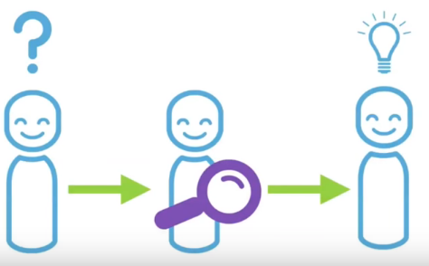

# Technical spikes

# What are technical spikes?

spike come from analogy to rock climbing when climbing we might stop to drive the spike in to the rock face driving this bike is not the actual climb and it doesen't propel you furtger the top but it rather it provides the safety it enabled the future climbing and it provides confidence for future climbing .

on software devlopment is analogous to that spike is a story or a task aimed at answering the question of gathering information as result of the spike you're not gonna produce a shippable code you just get more knowledge on more understanding on what you will produce later .

in agile software development , a spike is a story that cannot estimated until development team run a time boxed investigation .
The output of a spike is an estimated for original story

# When and why would a spike be useful?

___
# How would you successfully spike on a topic?
# Give an example of how a spike could have helped with last week's projects.

## When?

* **Spikes are great for helping a team that’s working in new technologies or breaking new ground with a “green field” project to understand the Product Owner’s needs.**

* **But they can be dangerous time sinks if the team isn’t careful about putting some pretty firm guardrails on them. With the appropriate guidance and constraints, though, technical spikes are a valuable tool in any team’s toolbox.**

## Why?

* **Spikes allow us to answer questions about stories the Product Owner has asked us to do but about which we lack some critical knowledge.**

* **We’re not looking to understand everything about the problem space. We want to simply know enough to be able to ask some relevant questions about the story and get an idea of the scope of work .**

### 1- Create a Small Test (Product Features):

* **Optimization.**
* **Features.**
* **Programming language.**

### 2- Pairing/Testing a Multitude of Approaches:

* **Testing many different approaches, and comparing the results.**
* **Share your solutions, provide recommendations.**
* **Features: More testing, more information, more insight. More capacity to generate solutions.**

* **Ecosystem: Comparing the products ecosystem.**
 * Human resource and human capital.
 * How many platforms?
 * Tools: Google Trends.

**Example:**

   Features   | environment  | Issues      | advantages      | Recommendations
   ---        |---           |---          |---              |----
   A, B, C, D |Environment A | Slow        | Easily readable | Do not use

### 3- Brief the Product's Owner.
Simple explanation of experiments and findings.
 * What we tried,
 * What we found,
 * Why we are using X, Y, Z.

# Give an example of how a spike could have helped with last week's projects.
At our last project we used flex box to introduce our team using four images with the name of each member below the image.

first we start building the section based on our knowledge without doing any research first but we face a problem with the responsive design before we start using flex box so after wasting some time we start searching on responsive design and how to fix the problem with our design.

Flex-Box was a new module to us so we should have spiked and did some research before we started coding and experimenting without studying Flex and its properties, using spike way would have saved us some time.  

